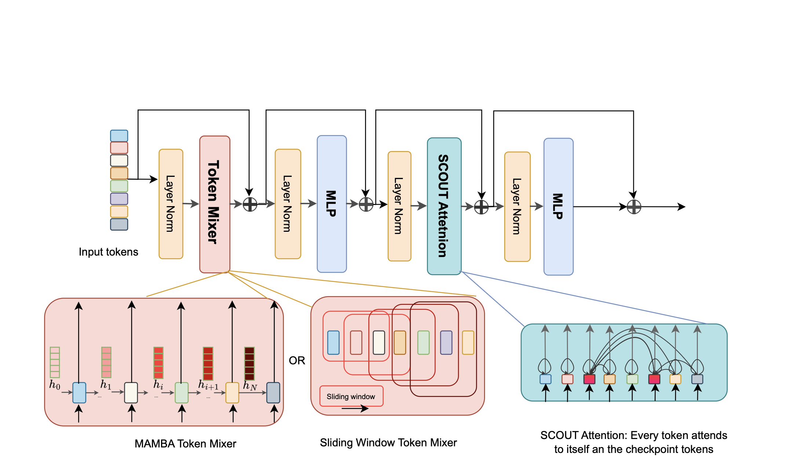

# SCOUT: Toward Sub-Quadratic Attention via Segment Compression for Optimized Utility in Transformers
<a target="_blank" href="https://arxiv.org/pdf/2509.00935">
</a>
<a target="_blank" href="https://github.com/ArefJafari/SCOUT">
</a>

## Abstract

**SCOUT** (Segment Compression for Optimized Utility in Transformers) is a hybrid long-sequence model that combines local mixing (via Mamba or sliding-window attention) with sparse attention over compressed checkpoints. Instead of attending to every past token, SCOUT compresses fixed-size segments into summary representations and only attends to these checkpoints. This design preserves much of the expressivity of full attention while scaling **sub-quadratically** in compute and memory.

## Introduction

Transformers have achieved state-of-the-art performance across domains but remain bottlenecked by the quadratic cost of self-attention.  

- **Linear state-space models** compress history into a recurrent state, but suffer from fading memory over long sequences.  
- **Hybrid models** mix fast local layers with occasional full attention, but still retain quadratic bottlenecks.  
- **Sparse attention methods** reduce costs via structured sparsity, but rely on fixed, input-agnostic patterns.  

**SCOUT** addresses this challenge by combining fast linear token mixers with sparse attention over compressed checkpoints, enabling sub-quadratic complexity while preserving global context.


<p align="center">
  
</p>

<p align="center">
  <b>Figure 1:</b> SCOUT architecture with different types of token mixer (Mamba or SWA).
</p>


## Method

SCOUT achieves sub-quadratic attention complexity by combining linear token mixing with sparse attention over compressed memory.  

Each layer consists of:

1. **Token Mixer (Mamba or SWA):** Encodes tokens with local context in linear time.  
2. **Checkpoint Compression:** Periodically extracts compressed memory slots that summarize past segments, enabling sparse attention to recover long-range dependencies.  
3. **Feedforward Networks (MLPs):** Standard transformations before and after checkpoint attention.  

This design preserves efficiency while maintaining both local and global context, eliminating the need for full attention layers.


# Training on FineWeb-Edu

This repository provides code and configuration for pretraining SCOUT variants using the [FineWeb-Edu](https://huggingface.co/datasets/HuggingFaceFW/fineweb-edu) dataset. 

---

## Codebase Overview

Our training infrastructure is primarily adapted from the [Samba](https://github.com/state-spaces/samba) and [TinyLlama](https://github.com/jzhang38/TinyLlama) codebases. The modeling code is based on Qwen2 and resides in the `model/` folder. The training script (`train.py`) and related utilities are under `train/`. Data processing code lives under `data/`. We also include [lm-evaluation-harness](https://github.com/EleutherAI/lm-evaluation-harness) as a submodule for evaluation.

---

## Pretraining from Scratch

### Data Preparation

Download the FineWeb-Edu dataset to your chosen directory using the script below:

```bash
python data/load_dataset.py --source_path /path/to/Fineweb-edu
```

This script will save the dataset into `.jsonl` shards in the specified path. Then, use the provided tokenizer and packing script to process the data into training-ready format.

```bash
python data/prepare_dataset.py --source_path /path/to/fine --tokenizer_path data/llama  --destination_path data/slim --split validation --percentage 1.0
python data/prepare_dataset.py --source_path /path/to/fine --tokenizer_path data/llama  --destination_path data/slim --split train --percentage 1.0
```

---

### Training

We provide bash launch scripts in `train/scripts/`. Here's an example script to train SCOUT-SWA-1.57B with 100B data on 8 GPUs:

```bash
#!/bin/bash

# Get the project root directory (assuming this script is in train/scripts/)
PROJECT_ROOT="$(cd "$(dirname "${BASH_SOURCE[0]}")/../.." && pwd)"

export CUDA_VISIBLE_DEVICES="0,1,2,3,4,5,6,7"
export PYTORCH_CUDA_ALLOC_CONF=max_split_size_mb:32
NUM_GPUS=8

# Training config
NAME="SCOUT_SWA_1.59B"
MODEL="${PROJECT_ROOT}/configs/scout_swa_1.57b.json"
CONFIG="1024x2k_100B"  # For 1B scale
MICRO_BATCH_SIZE=8
EVAL_ITERS=15
LR=3e-4

# Paths
OUTPUT_ROOT="${PROJECT_ROOT}/train"
TRAIN_DATA="${PROJECT_ROOT}/datasets/fineweb-edu/100B/fla_tokenized"
VALIDATION_DATA=None
SAVE_DIR="${PROJECT_ROOT}/save/"

# Run training
torchrun --nproc_per_node=${NUM_GPUS} --master_port=29500 ${OUTPUT_ROOT}/pretrain.py \
    --train_data_dir ${TRAIN_DATA} --val_data_dir ${VALIDATION_DATA} --output_root ${SAVE_DIR} \
    --exp_name ${NAME} --model_name ${MODEL} --eval_iters ${EVAL_ITERS} \
    --learning_rate ${LR} --micro_batch_size ${MICRO_BATCH_SIZE} --train_config ${CONFIG}
```

You can modify:

- `MODEL` to switch architectures (e.g., `configs/scout_swa_470m.json`)
- `CONFIG` to control token budget and sequence length (e.g., `"128x4k_15B"` for 15B tokens, global batch size 128, sequence length 4k)
- `NAME` to name each experiment run


Launch training using:

```bash
sh train/scripts/example_script.sh
```

---

## Evaluation

We use [lm-evaluation-harness](https://github.com/EleutherAI/lm-evaluation-harness) for evaluating trained models on zero-shot benchmarks.

### Installation

```bash
cd lm-evaluation-harness
pip install .
```

### Example: General Benchmarks

```bash
CUDA_VISIBLE_DEVICES=0 accelerate launch --num_processes 1 lm_eval --model hf \
  --model_args pretrained=model_path,tokenizer=fla-hub/transformer-1.3B-100B,dtype=bfloat16 \
  --tasks wikitext,lambada_openai,piqa,hellaswag,arc_easy,arc_challenge,mmlu,commonsense_qa \
  --batch_size 16 \
  --num_fewshot 0 \
  --output_path ./results/general/
```

### Example: LongBench Evaluation

```bash
CUDA_VISIBLE_DEVICES=0 accelerate launch --num_processes 1 lm_eval --model hf \
  --model_args pretrained=model_path,tokenizer=fla-hub/transformer-1.3B-100B,dtype=bfloat16 \
  --tasks longbench_e \
  --batch_size 1 \
  --output_path ./results/longbench/ \
  --show_config \
  --trust_remote_code \
  --gen_kwargs max_new_tokens=512,do_sample=False
```

---

##  Acknowledgements

This project builds upon the foundational work of several exceptional open-source initiatives. We gratefully acknowledge their contributions:

- [**Samba**](https://github.com/microsoft/Samba)  

- [**Lit-GPT**](https://github.com/Lightning-AI/lit-gpt)  

- [**TinyLLaMA**](https://github.com/jzhang38/TinyLlama)  

- [**Flash Linear Attention**](https://github.com/fla-org/flash-linear-attention)


### 📚 Citation

If you use SCOUT in your research, please cite:

```
@article{jafari2025scout},
  title={SCOUT: Toward Sub-Quadratic Attention via Segment Compression for Optimized Utility in Transformers},
  author={Jafari, Aref and Fan, Yuhe and Jamialahmadi, Benyamin and Farinneya, Parsa and Chen, Boxing and S. Tahaei, Marzieh},
  journal={arXiv preprint arXiv:2509.00935},
  year={2025}
}
```


